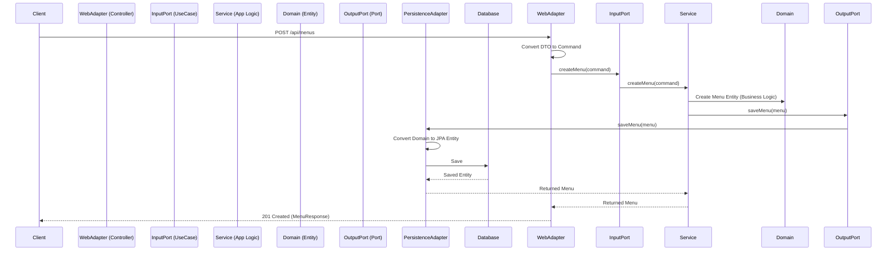

# NCafe 2026 Menu System - Clean Architecture Blueprint

## 1. Overview
This document outlines the proposed **Clean Architecture** structure for the Menu Management System. The goal is to separate core business logic from external concerns (Web, Database, Frameworks) to improve maintainability, testability, and flexibility.

## 2. Core Principles
- **Dependency Rule**: Source code dependencies used must point only inward, towards high-level policies.
- **Independence**: The core domain logic does not depend on frameworks, databases, or UI.

## 3. Package Structure (Proposed)

Current (Layered) -> **Proposed (Clean Architecture / Hexagonal)**

```
com.new_cafe.app.backend.menu
├── domain                 (핵심 비즈니스 로직 & 도메인 엔티티)
│   ├── model              (Menu, Category - 순수 자바 객체 POJO, 외부 라이브러리 의존성 없음)
│   └── exception          (도메인 규칙 위반 예외, 예: "가격은 음수일 수 없음")
│
├── application            (애플리케이션 유스케이스 & 비즈니스 흐름)
│   ├── port
│   │   ├── in             (Input Ports: 외부에서 내부로 들어오는 인터페이스 - UseCase)
│   │   │   ├── CreateMenuUseCase.java (메뉴 생성 인터페이스)
│   │   │   ├── GetMenuUseCase.java    (메뉴 조회 인터페이스)
│   │   │   └── UpdateMenuUseCase.java (메뉴 수정 인터페이스)
│   │   └── out            (Output Ports: 내부에서 외부로 나가는 인터페이스 - Repository)
│   │       ├── LoadMenuPort.java      (메뉴 데이터 로드용 인터페이스)
│   │       └── SaveMenuPort.java      (메뉴 데이터 저장용 인터페이스)
│   └── service            (Input Port를 구현하는 실제 비즈니스 로직 서비스)
│       └── MenuService.java           (트랜잭션 관리, 도메인 로직 호출 담당)
│
├── adapter                (외부 세계와의 연결 고리 - Interface Adapters)
│   ├── in
│   │   └── web            (Web 요청을 처리 - Controller)
│   │       ├── MenuController.java    (HTTP 요청을 받아 UseCase 호출)
│   │       ├── dto
│   │       │   ├── CreateMenuRequest.java (요청 데이터 객체)
│   │       │   └── MenuResponse.java      (응답 데이터 객체)
│   │       └── mapper
│   │           └── MenuWebMapper.java (DTO <-> Domain 객체 변환기)
│   └── out
│       └── persistence    (데이터 저장소 구현 - JPA)
│           ├── JpaMenuRepository.java (Spring Data JPA 인터페이스)
│           ├── MenuPersistenceAdapter.java (Output Port 구현체, JPA 사용)
│           ├── entity     (DB 테이블 매핑용 JPA 엔티티)
│           │   └── MenuJpaEntity.java
│           └── mapper
│               └── MenuPersistenceMapper.java (Domain <-> JPA Entity 변환기)
│
└── infrastructure         (프레임워크 설정 및 기술적인 부분)
    ├── config             (Spring Bean 설정, Security 설정 등)
    └── validation         (유효성 검사 로직 등)
```

## 4. Interaction Flow (Data Flow)

### 1) Creating a Menu


## 5. Key Changes & Benefits

| Feature | Layered (Current) | Clean Architecture (Proposed) | Benefit |
| :--- | :--- | :--- | :--- |
| **Dependency** | Controller -> Service -> Repository | Adapter -> Port <- Service -> Port <- Adapter | Decoupled from Frameworks |
| **Domain Logic** | Often mixed in Service/Entity | Pure Java Objects in `domain` | Highly Testable, Framework Agnostic |
| **Database** | JPA Entities heavily used | Separated JPA Entities & Domain Models | DB Schema changes don't affect logic |
| **Testing** | Integration tests required | Unit tests for Use Cases are easy | Faster feedback loop |

## 6. Implementation Steps
1.  **Define Domain Models**: Extract `Menu`, `Category` as pure POJOs.
2.  **Define Use Case Ports**: Create interfaces (`CreateMenuUseCase`, `LoadMenuPort`) defining *what* the system does.
3.  **Implement Application Service**: Write business logic implementing Input Ports.
4.  **Implement Adapters**:
    *   **Web**: Move existing Controllers to `adapter.in.web`.
    *   **Persistence**: Implement Output Ports using JPA Repositories in `adapter.out.persistence`.
5.  **Refactor**: Wire everything up using Spring's Dependency Injection.

---
**Next Steps:**
Please review this blueprint. If approved, I will proceed with refactoring the `Menu` module first.
